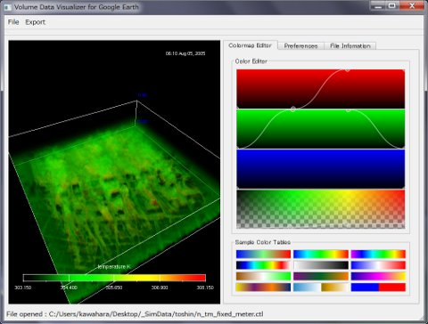
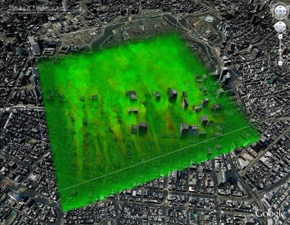
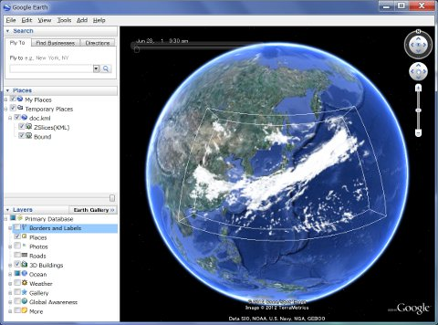

# Volume Data Visualizer for Google Earth (VDVGE)

*[English version is available here.](README.md)*

## 概要

Volume Data Visualizer for Google Earth (VDVGE) は、地球科学関連のデータ用可視化ソフトウェア [GrADS](https://cola.gmu.edu/grads/) で用いられる形式の三次元データを、[Google Earth](https://earth.google.com/) で表示可能なデータ形式にて可視化・出力するソフトウェアです。

GUI による簡単な操作で、KMLおよびCOLLADAファイルを用いたGoogle Earth Pro上でのボリュームレンダリング風表現（EXTRAWINGのような表現）を可能とします。

マルチプラットフォームのGUIツールキットである [Qt](https://www.qt.io/) を用いて開発しているため、共通のソースコードで Windows、Mac OS X、Linux でシームレスに動作します。現在のバージョンでは(ほぼ)大気データ専用ツールとなっていますが、今後海洋データ等についても対応する予定です。

## スクリーンショット

   
  <em>VDVGEの実行画面</em>

 

  
   
  <em>VDVGEで作成したファイルのGoogle Earth Pro上での表示例</em>

## サンプルデータ

リリースページで提供されているサンプルデータ(vdvge-sample)は、大気大循環モデル [AFES](https://gitlab.com/aosg_public/afes) (AGCM for Earth Simulator) により出力されたシミュレーションデータです。一つの物理量（雲水量）について、日本近海のみの切り出し・間引きを行ったものが含まれています。

## 入力可能なデータについて

本ソフトウェアで入力できる GrADS用データ（GrADS Descriptor File）には以下の制限があります。

* `DSET` で指定するバイナリファイルのフォーマットは、書式なしFORTRAN（単精度実数）のみとなります。また、テンプレート機能（`TEMPLATE` オプション）には対応していないため、実体のあるファイルを指定する必要があります。
* 入力可能な物理量は一つのスカラー場のみです（つまり、`VARS` キーワードに一つのパラメータのみ）。Descriptor File内に複数の物理量が含まれる場合、物理量毎に個別のファイルに分割しておいてください。
* `ZDEF` の単位は実高度（メートルまたはキロメートル）での指定となります。元のデータが気圧等、別の単位を用いている場合はあらかじめ変換が必要です。
* コントロールファイル内のその他未対応の命令の多くについては無視されます。

## 引用について

VDVGEを研究やソフトウェア開発で使用された場合は、以下の論文の引用をお願いいたします。

* Kawahara, S., Onishi, R., Goto, K., & Takahashi, K. (2015). Realistic representation of clouds in Google Earth. *Proc. SIGGRAPH Asia 2015 VHPC*. https://doi.org/10.1145/2818517.2818541

### その他の関連文献

**天文データへの応用に関する詳細論文（和文）:**
* Kawahara, S., Sugiyama, T., Araki, F., & Takahashi, K. (2015). VDVGE: Volume Visualization Software for Google Earth - Application to Astronomical Data -. *Journal of Space Science Informatics Japan*, 4, 161-171. (in Japanese)

**初期の開発および歴史的背景:**
* Araki, F., Kawahara, S., & Matsuoka, D. (2012). Studies of Large-Scale Data Visualization: EXTRAWING and Visual Data Mining. *Annual Report of the Earth Simulator Center April 2011 - March 2012*, 197-200.
* Araki, F., Kawahara, S., Matsuoka, D., Sugimura, T., Baba, Y., & Takahashi, K. (2011). Studies of Large-Scale Data Visualization: EXTRAWING and Visual Data Mining. *Annual Report of the Earth Simulator Center April 2010 - March 2011*, 195-198.

## 必須環境・注意事項

* **Qt**: VDVGEのコンパイルに必要です。コンパイル方法についてはマニュアルをご参照ください。
* **FFmpeg**: 動画出力機能を使用する場合に必要となります。
* **地形・海岸線データ**: 地形表示機能を使用する場合、標高データ（ETOPO1(etopo1_ice_g_i2.bin)、ETOPO2(ETOPO2v2g_i2_LSB.bin)、またはETOPO5(ETOPO5.DOS)）が必要です。海岸線表示機能を使用する場合は、海岸線データ（GEODAS Coastline）が必要となります。
* **グラフィックスハードウェア**: OpenGLの3Dテクスチャ機能を使用しているため、OpenGL 1.2以上に対応したハードウェアが必要です。

## ライセンス

* 本ソフトウェアは [GPL Ver 3.0](http://www.gnu.org/licenses/) に準拠いたします。
* 本ソフトウェアのソースコードの一部は、Qt SDK に付属のサンプルプログラムを改変して使用しています。対象となるファイルについては、各ソースコードのヘッダ部に明記されています。

## 商標について

Google Earth は Google LLC の商標です。本書に記載されているその他の製品名および会社名は、各社の商標である場合があります。
